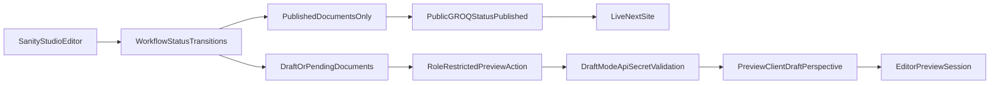

# Enterprise Content Workflow And Preview Plan

## Scope And Decisions
- Use **dedicated schemas** (not only `post`/`sitePage`) for blogs, service pages, landing pages, case studies, and SEO pages.
- Use **secret + role-restricted Studio preview actions** for preview entry control.
- Keep production safe with a **phased cutover** so existing pages do not break during migration.

## Phase 1: Workflow Foundation In Sanity
- Add shared workflow fields (`status`, `reviewerNotes`, `rejectionNotes`, `approvalHistory`, `approvedAt`, `approvedBy`, optional `scheduledPublishAt`) as reusable schema utilities under new schema helper files in `sanity/schemaTypes`.
- Add status enum exactly: `draft`, `pendingReview`, `pendingApproval`, `approved`, `published`, `rejected` with default `draft`.
- Apply workflow fields to existing schemas first to preserve data continuity:
  - [sanity/schemaTypes/post.ts](sanity/schemaTypes/post.ts)
  - [sanity/schemaTypes/sitePage.ts](sanity/schemaTypes/sitePage.ts)

## Phase 2: Split Content Model (Chosen Direction)
- Create dedicated document schemas:
  - `blogPost`, `servicePage`, `landingPage`, `caseStudyPage`, `seoPage`
- Add route/slug structures matching current app routes and metadata needs.
- Register all types in [sanity/schema.ts](sanity/schema.ts).
- Keep old `sitePage` readable during migration; mark as legacy in schema title/description.

## Phase 3: Role-Aware Studio Governance
- Add custom document actions (submit for review, request approval, approve, publish, reject) with role checks using Studio `currentUser` roles.
- Prevent direct publish action for non-authorized roles by replacing default publish action in [sanity.config.ts](sanity.config.ts).
- Add status badge components in document views/list previews.
- Add reviewer and rejection note validation on transitions (e.g., rejection requires note).

## Phase 4: Production-Safe Frontend Filtering
- Update GROQ query layer in [sanity/lib/queries.ts](sanity/lib/queries.ts) so public fetches only return `status == "published"`.
- Enforce this for blogs, page content, and SEO metadata fetch paths by updating:
  - [sanity/lib/getPosts.ts](sanity/lib/getPosts.ts)
  - [sanity/lib/getSitePage.ts](sanity/lib/getSitePage.ts)
  - all page consumers under `src/app/**/page.tsx` already using these helpers.
- Introduce centralized guard helpers so future queries cannot accidentally bypass published-only filtering.

## Phase 5: Draft Preview System (Secure + Role-Driven)
- Add secure draft entry route: `src/app/api/draft-mode/route.ts`.
- Validate secret token and sanitized target path; reject open redirects.
- Add disable endpoint: `src/app/api/draft-mode/disable/route.ts`.
- Add preview URL resolver utility mapping each content type to frontend path (blog slug, service slug, landing slug, case study slug, SEO route).
- Add role-restricted Studio preview action/button that opens `/api/draft-mode` for editors/reviewers/admins only.

## Phase 6: Draft-Aware Data Fetching
- Refactor [sanity/lib/client.ts](sanity/lib/client.ts) to expose two server-only clients:
  - public published client
  - preview client (token + draft perspective) when `draftMode().isEnabled`
- Ensure preview fetches bypass cache where needed, while public fetches stay cache/revalidate friendly.
- Add preview-aware query variants for all new content types.

## Phase 7: Scheduling Strategy (Preferred)
- Add `scheduledPublishAt` field and schema validation (`approved` required before scheduling).
- Implement immediate safe behavior:
  - public query includes `scheduledPublishAt <= now()` (or unset)
- Document auto-release options:
  - Sanity Scheduled Publishing / Releases (recommended)
  - or server cron webhook worker as fallback.

## Phase 8: Migration And Verification
- Backfill existing documents to `status = "published"` for currently live content using migration script under `sanity/migrations`.
- Add verification checklist:
  - public site never renders non-published content
  - preview shows draft/unpublished content only with active draft session
  - role restrictions enforced for approval/publish transitions
  - SEO metadata obeys published filter
- Run regression checks on key routes (`/`, `/platform`, `/capabilities/*`, `/outcomes`, `/use-cases`, `/insights`, `/insights/[slug]`).

## Architecture Flow

## Primary Files Impacted
- [sanity.config.ts](sanity.config.ts)
- [sanity/schema.ts](sanity/schema.ts)
- [sanity/schemaTypes/post.ts](sanity/schemaTypes/post.ts)
- [sanity/schemaTypes/sitePage.ts](sanity/schemaTypes/sitePage.ts)
- `sanity/schemaTypes/*` (new dedicated content + workflow utility files)
- [sanity/lib/client.ts](sanity/lib/client.ts)
- [sanity/lib/queries.ts](sanity/lib/queries.ts)
- [sanity/lib/getPosts.ts](sanity/lib/getPosts.ts)
- [sanity/lib/getSitePage.ts](sanity/lib/getSitePage.ts)
- `src/app/api/draft-mode/route.ts` (new)
- `src/app/api/draft-mode/disable/route.ts` (new)
- `src/app/**/page.tsx` route consumers for query/helper updates